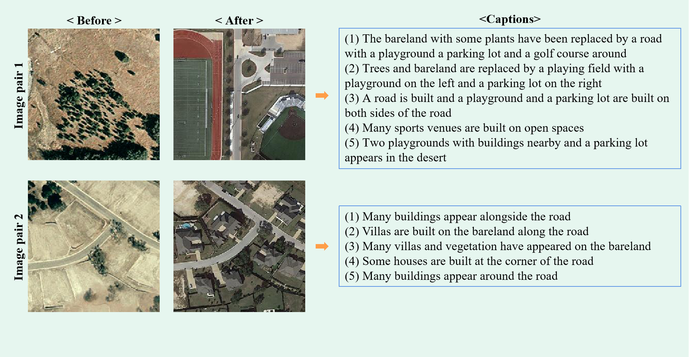

# Remote Sensing Image Change Captioning (RSICC)

Our paper proposing this dataset is under peer review, and we will make our dataset publicly available in the future.

## LEVIR-CC Dataset
To explore the Remote Sensing Image Change Captioning (RSICC) task, we build a large-scale dataset named LEVIR-CC, which contains 10077 pairs of bi-temporal RS images and 50385 sentences describing the differences between images. The novel dataset provides an opportunity to explore models that align visual changes and language. We believe the dataset will promote the research of RSICC. 

Some examples of our dataset are as follows:

