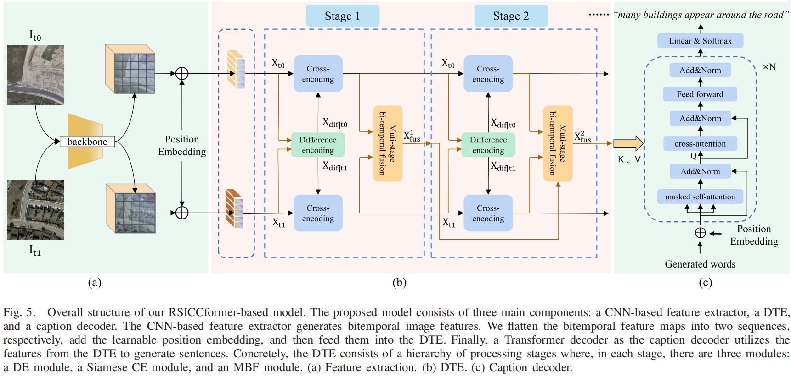
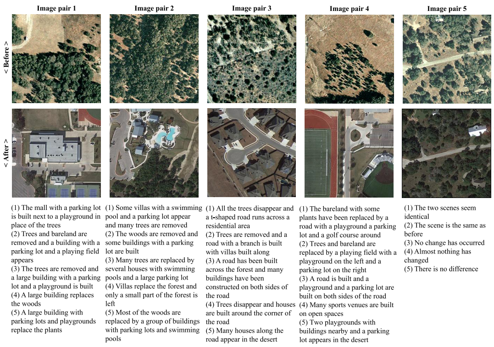

# Remote Sensing Image Change Captioning With Dual-Branch Transformers: A New Method and a Large Scale Dataset


## Share us a :star: if this repo does help

Here, we provide the pytorch implementation of the paper: "Remote Sensing Image Change Captioning With Dual-Branch Transformers: A New Method and a Large Scale Dataset". 

For more ore information, please see our published paper in [[IEEE](https://ieeexplore.ieee.org/document/9934924) | [Lab Server](http://levir.buaa.edu.cn/publications/ChangeCaptioning.pdf)]  ***(Accepted by TGRS 2022)***




## LEVIR-CC Dataset Download Source
- All of the Dataset: [[Google Drive](https://drive.google.com/drive/folders/1cEv-BXISfWjw1RTzL39uBojH7atjLdCG?usp=sharing)  &#124; [Baidu Pan](https://pan.baidu.com/s/1YrWcz090kdqOZ0lrbqXJJA) (code:nq9y)]

The path list in the downloaded folder is as follows:
```python
path to LEVIR_CC_dataset:
                ├─LevirCCcaptions.json
                ├─images
                  ├─train
                  │  ├─A
                  │  ├─B
                  ├─val
                  │  ├─A
                  │  ├─B
                  ├─test
                  │  ├─A
                  │  ├─B
```
where A contains images of pre-phase, B contains images of post-phase.

The LEVIR-CC dataset contains 10077 pairs of bi-temporal remote sensing images and 50385 sentences describing the differences between images.
Some examples of our dataset are as follows:


## Installation
Clone this repo:
```python
git clone https://github.com/Chen-Yang-Liu/RSICC
cd RSICC
```

## Quick Start
You can download our RSICCformer pretrained model——by [[Google Drive](https://drive.google.com/drive/folders/1cEv-BXISfWjw1RTzL39uBojH7atjLdCG?usp=sharing)  &#124; [Baidu Pan](https://pan.baidu.com/s/1SBGjVS0yd2KHdK9t4NuiyA) (code:2fbc)]

After downloaded the pretrained model, you can put it in `./models_checkpoint/`.

Then, run a demo to get started as follows:
```python
python caption.py --img_A ./Example/A/train_000016.png --img_B ./Example/B/train_000016.png --path ./models_checkpoint/
```
After that, you can find the generated caption in `./eval_results/`

## Train
Firstly, put the downloaded dataset in `./LEVIR_CC_dataset/`.
Then preprocess dataset for training as follows:
```python
python create_input_files.py
```
After that, you can find some files in `./data/`. Then, start training as follows:
```python
python train.py  --data_folder ./data/ --savepath ./models_checkpoint/
```

## Evaluate
```python
python eval.py --data_folder ./data/ --path ./models_checkpoint/ --Split TEST
```

## Citation: 
```
@ARTICLE{9934924,
  author={Liu, Chenyang and Zhao, Rui and Chen, Hao and Zou, Zhengxia and Shi, Zhenwei},
  journal={IEEE Transactions on Geoscience and Remote Sensing}, 
  title={Remote Sensing Image Change Captioning With Dual-Branch Transformers: A New Method and a Large Scale Dataset}, 
  year={2022},
  volume={60},
  number={},
  pages={1-20},
  doi={10.1109/TGRS.2022.3218921}}
```
## Reference:
https://github.com/sgrvinod/a-PyTorch-Tutorial-to-Image-Captioning.git


